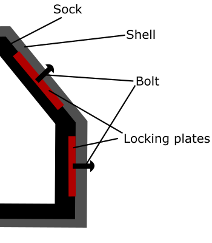
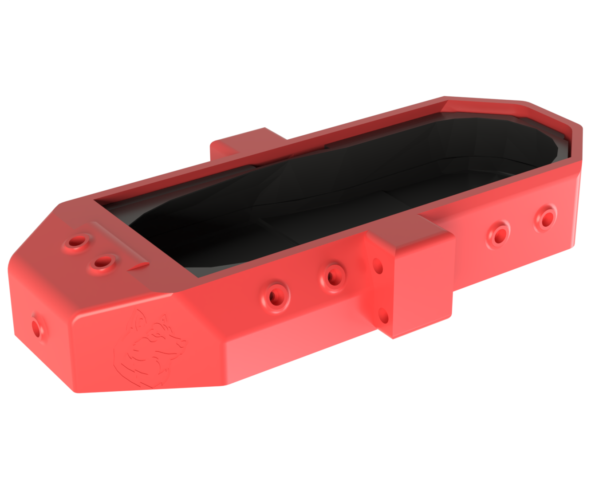

# Unitree-G1-Roller-Skate-Module
This repository open-sources the hardware design of a non-invasive adaptive roller skate module developed specifically for the Unitree G1 humanoid robot platform. By providing a low-cost modal extension to the underlying hardware layer , this module aims to facilitate the research of highly efficient hybrid bipedal-skating locomotion strategies and advanced dynamic control algorithms.

## Core Design Principles
When standard commercial humanoid robots transition to high-impact locomotion modes such as roller skating, their factory-default foot structures are highly susceptible to material damage caused by the concentration of axial and lateral composite stresses. Because the factory bolt holes on the original foot base face a high risk of material aging and fatigue-induced thread stripping during long-term experimental operations, this project bypasses destructive modifications or direct component replacement, opting instead for a longitudinally split, clamshell physical wrapping and constraint strategy.

The system relies on a hybrid dual-layer architecture composed of a flexible liner and a rigid shell to execute complex mechanical decoupling. The internal flexible liner (TPU Sock) is formed through a full-surface Boolean subtraction operation based on the official 3D model of the robot's foot. While ensuring a highly conformal fit to the complex curves, this liner provides effective axial cushioning and high-frequency vibration absorption, acting as a critical physical barrier that prevents the rigid structural components from scratching the robot's factory surface finish during high-load operations. Meanwhile, the rigid external shell, serving as the primary load-bearing skeleton, interfaces directly with the robot's rigid sole base to ensure the seamless transmission of lateral pushing forces and vertical gravitational loads without structural deformation.

  
  

## 3D Printing and Material Reinforcement Parameters
To withstand high-frequency vibrations under multi-axis loading and extend the structural fatigue life, the fabrication process strictly follows a load-oriented orientation principle and an isotropic topological reinforcement strategy.

The rigid external structural frame is fabricated using Carbon Fiber Reinforced Polylactic Acid (PLA-CF), which offers a high specific stiffness, while its internal volume completely utilizes a Gyroid infill pattern at a 50% density. This continuous, triply periodic minimal surface effectively dissipates stresses and distributes multi-directional torques evenly, eliminating the localized stress concentrations typically found at the sharp vertices of traditional honeycomb or grid patterns, thereby significantly mitigating the risk of interlaminar delamination and brittle fracture.

Regarding build orientation, components subjected to bending moments or cantilever loads prioritize a flat-laying posture to align the primary stress paths with the continuous filament extrusion paths, thereby extending the fatigue life of the mechanical interfaces. Simultaneously, to ensure the geometric fidelity of precision connection features like bolt holes, the design aligns hole axes parallel to the Z-axis to leverage the superior cylindricity of the Fused Deposition Modeling (FDM) process, establishing a persistent interference fit that achieves a zero-backlash state.

## Assembly and Powertrain Integration
The entire module supports rapid assembly, disassembly, and streamlined maintenance by a single person, following an inside-out mechanical integration logic. First, four customized rigid locking plates are embedded into pre-designed slots on the flexible liner's surface, establishing a localized rigid reinforcement structure capable of bearing axial fastening loads. Subsequently, the entire liner assembly wraps around the lower rigid section of the robot's foot from both directions. The external load-bearing shell is then fitted over the assembly, and bolts are tightened through the shell's counterbore holes to exert an inward axial force directly onto the locking plates, compressing the shell, locking plates, and flexible liner into a single fully constrained rigid unit. Finally, commercial aluminum blade holders and wheel sets featuring high torsional stiffness are fastened directly to the thickened bottom of the shell, establishing a continuous, highly efficient force flow path from the robot's rigid sole through to the ground.

## Experimental Performance and Design Boundaries
The structural integrity of the module was evaluated with the G1 robot in a bipedal standing posture supporting a total mass of approximately 35 kg. Through the synergy between the rigid external shell and the internal flexible liner, the assembly maintained sufficient stiffness to resist vertical gravitational forces while facilitating uniform stress distribution across the foot. No observable stress whitening, cracking, or plastic deformation was detected at critical stress concentration points, proving its excellent vertical load transmission rigidity.

It must be noted, however, that the current validation boundaries are strictly confined to static load-bearing and low-speed manual maneuvering. The structural reliability and load-bearing capacity during actual dynamic skating movement have not been evaluated in this phase, as physical skating tests have not yet been executed. Although threading the bolts directly into the 3D-printed substrate demonstrated adequate preliminary shear strength under the full static weight , integrating threaded brass heat-set inserts is recognized as a necessary requirement for enhancing thread durability during subsequent high-impulse skating trials. This modification will establish a long-lasting, wear-resistant metal-to-metal threading environment to completely eliminate the risk of thread stripping.

